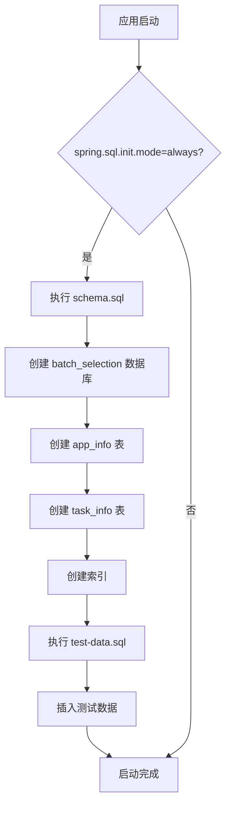

# 配置文件

<cite>
**本文档中引用的文件**   
- [application.properties](file://backend/src/main/resources/application.properties)
- [schema.sql](file://backend/src/main/resources/schema.sql)
- [test-data.sql](file://backend/src/main/resources/test-data.sql)
- [BatchSelectionApplication.java](file://backend/src/main/java/com/example/batchselection/BatchSelectionApplication.java)
- [AppInfo.java](file://backend/src/main/java/com/example/batchselection/entity/AppInfo.java)
- [TaskInfo.java](file://backend/src/main/java/com/example/batchselection/entity/TaskInfo.java)
- [CorsConfig.java](file://backend/src/main/java/com/example/batchselection/config/CorsConfig.java) - *新增的全局跨域配置类*
</cite>

## 更新摘要
**变更内容**   
- 在“配置文件概述”中补充了新增的CORS配置背景
- 新增“全局跨域配置说明”章节，详细解释 `CorsConfig` 类的实现机制与优势
- 更新“配置修改建议”以包含跨域安全建议
- 所有文件引用均已按中文命名规范显示，并标注新增文件状态

## 目录
1. [配置文件概述](#配置文件概述)
2. [服务器配置解析](#服务器配置解析)
3. [数据源配置详解](#数据源配置详解)
4. [JPA自动建表策略](#jpa自动建表策略)
5. [SQL脚本初始化机制](#sql脚本初始化机制)
6. [日志级别配置说明](#日志级别配置说明)
7. [Jackson序列化配置](#jackson序列化配置)
8. [数据库初始化流程](#数据库初始化流程)
9. [全局跨域配置说明](#全局跨域配置说明)
10. [配置修改建议](#配置修改建议)
11. [常见问题排查](#常见问题排查)

## 配置文件概述

`application.properties` 是 Spring Boot 应用的核心配置文件，位于 `backend/src/main/resources/` 目录下，定义了服务端口、数据库连接、JPA 行为、SQL 初始化、日志和 JSON 序列化等关键参数。该文件与 `schema.sql` 和 `test-data.sql` 配合，实现数据库的自动创建和数据初始化。**新增的 `CorsConfig.java` 配置类实现了全局跨域支持，解决了前端开发环境与后端服务分离部署时的跨域请求问题**。

**Section sources**
- [application.properties](file://backend/src/main/resources/application.properties#L1-L34)
- [CorsConfig.java](file://backend/src/main/java/com/example/batchselection/config/CorsConfig.java) - *新增的全局跨域配置类*

## 服务器配置解析

`server.port=8080` 指定应用监听的 HTTP 端口为 8080。这是 Spring Boot 的默认端口，可通过此配置项修改。若端口被占用，应用启动将失败。`server.servlet.context-path=/` 设置应用的上下文路径为空，即所有 API 路径直接以 `/api` 开头。

**Section sources**
- [application.properties](file://backend/src/main/resources/application.properties#L4-L5)

## 数据源配置详解

数据源配置通过 `spring.datasource.*` 前缀定义数据库连接信息：
- `url`：JDBC 连接字符串，包含多个关键参数：
  - `useUnicode=true&characterEncoding=utf8`：启用 UTF-8 字符编码，确保中文等多字节字符正确存储。
  - `useSSL=false`：禁用 SSL 加密连接，适用于本地开发环境，生产环境建议启用。
  - `serverTimezone=Asia/Shanghai`：设置服务器时区为上海，避免时间字段出现时区偏差。
  - `allowPublicKeyRetrieval=true`：允许客户端从服务器检索公钥，解决某些 MySQL 8.x 版本的连接问题。
  - `createDatabaseIfNotExist=true`：若数据库 `batch_selection` 不存在，则自动创建。
- `username` 和 `password`：数据库登录凭证。
- `driver-class-name`：指定 MySQL JDBC 驱动类。

**Section sources**
- [application.properties](file://backend/src/main/resources/application.properties#L8-L11)

## JPA自动建表策略

`spring.jpa.hibernate.ddl-auto=update` 是 JPA 的 DDL 自动执行策略，其行为如下：
- **update**：启动时自动根据实体类（如 `AppInfo`、`TaskInfo`）更新数据库表结构。若表不存在则创建，若字段变更则添加或修改，但**不会删除**已有列。
- 其他可选值：`create`（每次启动重建表，数据丢失）、`create-drop`（启动创建，关闭删除）、`validate`（仅验证表结构，不修改）、`none`（禁用自动DDL）。
- `spring.jpa.show-sql=true` 启用 SQL 日志输出，便于调试。
- `spring.jpa.properties.hibernate.dialect=org.hibernate.dialect.MySQL8Dialect` 指定使用 MySQL 8 方言，优化 SQL 生成。

**Section sources**
- [application.properties](file://backend/src/main/resources/application.properties#L14-L17)
- [AppInfo.java](file://backend/src/main/java/com/example/batchselection/entity/AppInfo.java#L1-L62)
- [TaskInfo.java](file://backend/src/main/java/com/example/batchselection/entity/TaskInfo.java#L1-L54)

## SQL脚本初始化机制

Spring Boot 提供了 `spring.sql.init.*` 配置项来管理数据库初始化：
- `spring.sql.init.mode=always`：无论 `ddl-auto` 为何值，都**始终执行** `schema.sql` 和 `data.sql` 脚本。
- `spring.sql.init.data-locations=classpath:test-data.sql`：指定数据初始化脚本的位置，此处加载 `test-data.sql`。
- `spring.sql.init.continue-on-error=true`：即使脚本中某条 SQL 执行失败（如 `DELETE FROM app_info` 表不存在），也继续执行后续语句。
- `spring.jpa.defer-datasource-initialization=true`：确保 SQL 脚本在 JPA 实体映射之前执行，避免冲突。

**Section sources**
- [application.properties](file://backend/src/main/resources/application.properties#L21-L23)
- [schema.sql](file://backend/src/main/resources/schema.sql#L1-L38)
- [test-data.sql](file://backend/src/main/resources/test-data.sql#L1-L17)

## 日志级别配置说明

日志配置控制应用的输出信息量：
- `logging.level.root=INFO`：根日志级别设为 INFO，仅输出 INFO 及以上级别（WARN、ERROR）的日志。
- `logging.level.com.example.batchselection=DEBUG`：将应用包 `com.example.batchselection` 的日志级别设为 DEBUG，可输出详细的调试信息，如 `BatchSelectionController` 中的 `log.info()` 和 `log.error()`。
- `logging.pattern.console`：定义控制台日志的输出格式，包含时间、线程、日志级别、类名和消息。

**Section sources**
- [application.properties](file://backend/src/main/resources/application.properties#L26-L28)
- [BatchSelectionController.java](file://backend/src/main/java/com/example/batchselection/controller/BatchSelectionController.java#L19-L64)

## Jackson序列化配置

`spring.jackson.*` 配置项影响 JSON 序列化行为：
- `spring.jackson.time-zone=GMT+8`：设置时区为东八区，确保 `LocalDateTime` 字段序列化时使用正确的时区。
- `spring.jackson.date-format=yyyy-MM-dd HH:mm:ss`：指定日期时间的输出格式，使 API 返回的日期字段（如 `created_at`）统一为此格式。
- `spring.jackson.serialization.write-dates-as-timestamps=false`：禁止将日期写为时间戳（毫秒数），而是输出格式化的字符串。

**Section sources**
- [application.properties](file://backend/src/main/resources/application.properties#L31-L33)
- [AppInfo.java](file://backend/src/main/java/com/example/batchselection/entity/AppInfo.java#L46-L49)
- [TaskInfo.java](file://backend/src/main/java/com/example/batchselection/entity/TaskInfo.java#L47-L48)

## 数据库初始化流程

应用启动时，数据库初始化按以下顺序执行：
1. **创建数据库**：根据 `schema.sql` 中的 `CREATE DATABASE IF NOT EXISTS batch_selection` 语句，创建名为 `batch_selection` 的数据库（如果不存在），并设置字符集为 `utf8mb4`。
2. **切换数据库**：执行 `USE batch_selection`，后续操作在此数据库中进行。
3. **创建表结构**：
   - `app_info` 表：存储应用和分组的基础信息，包含主键 `id`、多个业务字段和 `created_at`、`updated_at` 时间戳。
   - `task_info` 表：存储用户提交的任务快照，包含 `task_id` 主键和 `created_at` 时间戳。
4. **创建索引**：
   - `idx_app_group`：在 `app_info` 表的 `app_name` 和 `group_name` 字段上创建联合索引，优化按应用和分组查询的性能。
   - `idx_created_at`：在 `task_info` 表的 `created_at` 字段上创建索引，优化按时间查询任务的性能。
5. **插入测试数据**：执行 `test-data.sql` 中的 `INSERT INTO app_info` 语句，向 `app_info` 表填充 10 条测试数据。

**Diagram sources**
- [schema.sql](file://backend/src/main/resources/schema.sql#L1-L38)
- [test-data.sql](file://backend/src/main/resources/test-data.sql#L1-L17)

**Section sources**
- [application.properties](file://backend/src/main/resources/application.properties#L21-L23)
- [schema.sql](file://backend/src/main/resources/schema.sql#L1-L38)
- [test-data.sql](file://backend/src/main/resources/test-data.sql#L1-L17)

## 全局跨域配置说明

为解决前端开发服务器（如 Vite）与后端 Spring Boot 服务跨域请求问题，项目新增了 `CorsConfig.java` 全局跨域配置类。该配置通过 `@Configuration` 和 `@Bean` 注解注册 `CorsFilter`，实现对所有请求的统一跨域处理。

**核心配置参数**：
- `addAllowedOriginPattern("*")`：允许所有来源，包括 `file://` 协议打开的本地 HTML 文件，支持更灵活的前端调试。
- `addAllowedHeader("*")`：允许所有请求头，兼容自定义头部（如 `Authorization`）。
- `addAllowedMethod("*")`：允许所有 HTTP 方法（GET、POST、PUT、DELETE 等）。
- `setAllowCredentials(true)`：允许携带认证凭证（如 Cookie、JWT），支持需要身份验证的接口。
- `registerCorsConfiguration("/**", config)`：将配置应用于所有路径。

**优势对比**：
| 传统方式 | 全局配置 |
|--------|---------|
| 需在每个 Controller 或方法上添加 `@CrossOrigin` | 一次配置，全局生效 |
| 配置分散，易遗漏 | 集中管理，维护方便 |
| 不支持 `file://` 协议 | 显式支持本地文件协议 |
| 无法统一凭证策略 | 统一控制 `Allow-Credentials` |

**Section sources**
- [CorsConfig.java](file://backend/src/main/java/com/example/batchselection/config/CorsConfig.java#L1-L35) - *新增的全局跨域配置*

## 配置修改建议

1. **生产环境安全**：
   - 将 `useSSL=false` 改为 `true` 并配置 SSL 证书。
   - 修改数据库密码，避免使用明文弱密码。
   - 考虑将 `ddl-auto` 设为 `validate` 或 `none`，防止生产环境意外修改表结构。
   - **调整 CORS 配置**：生产环境应将 `addAllowedOriginPattern("*")` 改为具体域名（如 `https://yourdomain.com`），避免开放所有来源带来的安全风险。

2. **性能优化**：
   - 根据实际查询模式，为 `app_info` 表的 `idc`、`zone` 等字段添加单列索引。
   - 调整 `logging.level.com.example.batchselection` 为 `INFO` 或 `WARN`，减少生产日志量。

3. **时区一致性**：
   - 确保所有环境（开发、测试、生产）的 MySQL 服务器时区与 `serverTimezone` 配置一致。

## 常见问题排查

1. **应用无法启动，数据库连接失败**：
   - 检查 MySQL 服务是否运行。
   - 验证 `application.properties` 中的 `url`、`username`、`password` 是否正确。
   - 确认 MySQL 用户有权限访问 `batch_selection` 数据库。

2. **中文乱码**：
   - 确认 `schema.sql` 中数据库和表的 `CHARSET` 为 `utf8mb4`。
   - 检查 JDBC URL 中是否包含 `characterEncoding=utf8`。

3. **时间字段差8小时**：
   - 确认 `serverTimezone=Asia/Shanghai` 已配置。
   - 检查 `spring.jackson.time-zone=GMT+8` 是否设置。

4. **SQL脚本未执行**：
   - 确认 `spring.sql.init.mode=always` 已启用。
   - 检查 `schema.sql` 和 `test-data.sql` 文件是否位于 `src/main/resources/` 目录下。

5. **JPA自动建表未生效**：
   - 确认 `spring.jpa.hibernate.ddl-auto` 值正确。
   - 检查实体类（`AppInfo`、`TaskInfo`）上的 JPA 注解（如 `@Entity`、`@Table`）是否正确。

6. **跨域请求被拒绝**：
   - 确认 `CorsConfig.java` 已正确加载（检查 Spring Boot 启动日志）。
   - 若为生产环境，避免使用 `*` 通配符，应配置具体允许的域名。
   - 检查前端请求是否携带了 `Authorization` 等自定义头，确保后端 `addAllowedHeader("*")` 已启用。