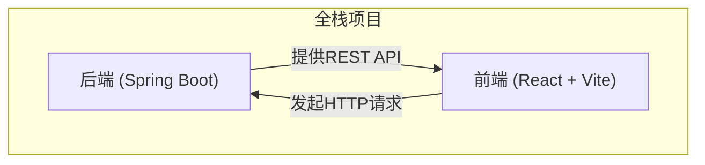
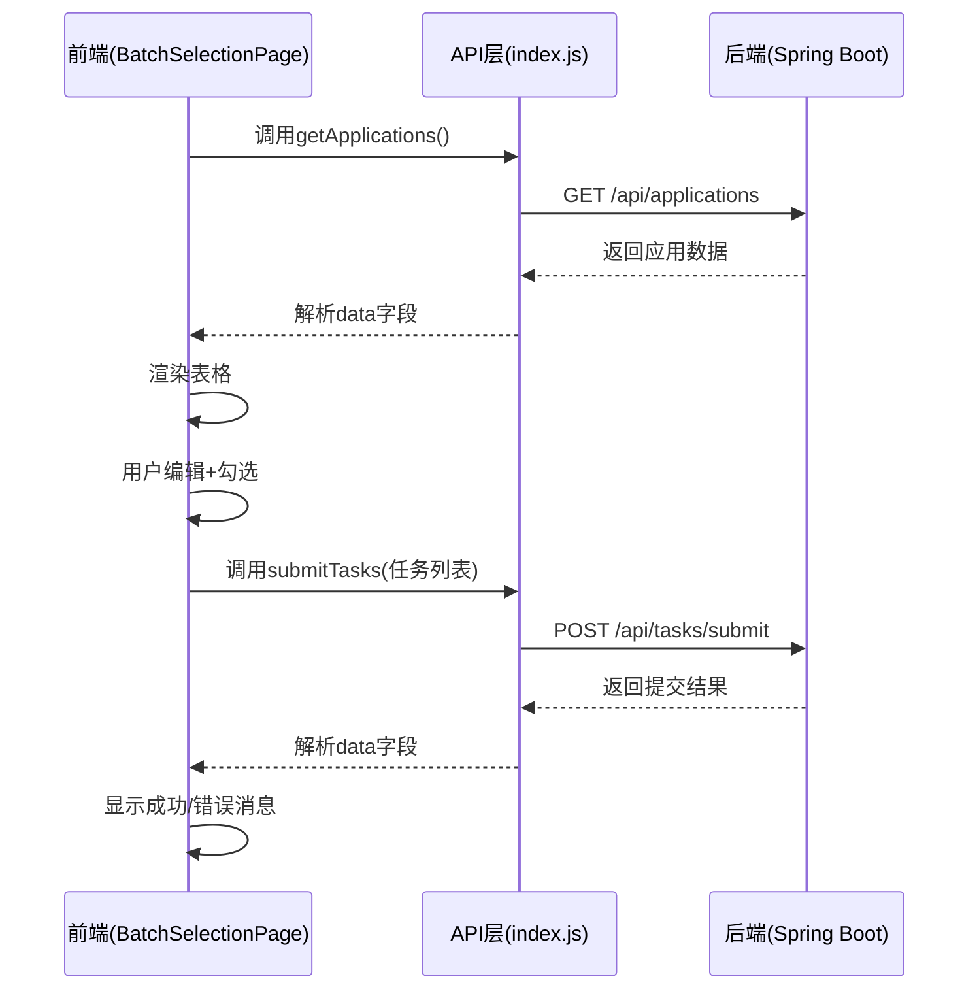

# 项目目录结构

<cite>
**本文档中引用的文件**  
- [BatchSelectionController.java](file://backend/src/main/java/com/example/batchselection/controller/BatchSelectionController.java)
- [BatchSelectionService.java](file://backend/src/main/java/com/example/batchselection/service/BatchSelectionService.java)
- [TaskInfoRepository.java](file://backend/src/main/java/com/example/batchselection/repository/TaskInfoRepository.java)
- [TaskInfo.java](file://backend/src/main/java/com/example/batchselection/entity/TaskInfo.java)
- [TaskSubmitDTO.java](file://backend/src/main/java/com/example/batchselection/dto/TaskSubmitDTO.java)
- [application.properties](file://backend/src/main/resources/application.properties)
- [schema.sql](file://backend/src/main/resources/schema.sql)
- [test-data.sql](file://backend/src/main/resources/test-data.sql)
- [index.js](file://frontend/src/api/index.js)
- [BatchSelectionPage.jsx](file://frontend/src/components/BatchSelectionPage.jsx)
- [vite.config.js](file://frontend/vite.config.js)
- [index.html](file://frontend/index.html)
</cite>

## 目录

1. [项目整体结构](#项目整体结构)
2. [后端模块解析](#后端模块解析)
3. [前端模块解析](#前端模块解析)
4. [前后端交互机制](#前后端交互机制)
5. [配置文件详解](#配置文件详解)

## 项目整体结构

本项目为典型的全栈应用，采用前后端分离架构，包含 `backend` 和 `frontend` 两大核心模块，分别负责服务端逻辑与用户界面展示。

**Diagram sources**  
- [backend](file://backend)
- [frontend](file://frontend)

## 后端模块解析

后端基于 Spring Boot 框架构建，采用标准的 MVC 分层架构，代码组织清晰，职责分明。

### controller 层：请求入口与路由控制

`controller` 包作为系统的入口层，负责接收 HTTP 请求、参数校验与响应封装。该层通过注解驱动的方式定义 RESTful 接口。

例如，`BatchSelectionController` 提供了两个核心接口：
- `GET /api/applications`：获取所有应用数据
- `POST /api/tasks/submit`：批量提交任务

该层通过依赖注入使用 `BatchSelectionService` 完成业务逻辑处理，并利用 `ApiResponse` 统一封装返回结果。

**Section sources**  
- [BatchSelectionController.java](file://backend/src/main/java/com/example/batchselection/controller/BatchSelectionController.java#L1-L64)

### service 层：核心业务逻辑处理

`service` 包定义了业务逻辑接口及其实现，是系统的核心处理单元。接口 `BatchSelectionService` 声明了两个主要方法：
- `getAllApplications()`：查询所有应用及其分组信息
- `submitTasks(List<TaskSubmitDTO>)`：批量提交任务并返回结果

具体实现位于 `impl` 子包中，遵循接口与实现分离的设计原则，便于扩展与测试。

**Section sources**  
- [BatchSelectionService.java](file://backend/src/main/java/com/example/batchselection/service/BatchSelectionService.java#L1-L26)
- [BatchSelectionServiceImpl.java](file://backend/src/main/java/com/example/batchselection/service/impl/BatchSelectionServiceImpl.java)

### repository 层：数据访问接口

`repository` 包封装了对数据库的访问操作，基于 Spring Data JPA 实现。`TaskInfoRepository` 接口继承自 `JpaRepository`，自动获得常见的 CRUD 操作能力，无需手动编写 SQL。

该层与 `entity` 实体类一一对应，通过方法命名约定或自定义查询实现复杂数据检索。

**Section sources**  
- [TaskInfoRepository.java](file://backend/src/main/java/com/example/batchselection/repository/TaskInfoRepository.java#L1-L13)

### entity 层：持久化数据模型

`entity` 包中的类映射数据库表结构，代表持久化实体。`TaskInfo` 类对应 `task_info` 表，使用 JPA 注解定义字段与表关系：
- `@Entity` 标识为实体类
- `@Table` 指定表名与索引
- `@Id` 与 `@GeneratedValue` 定义主键策略
- `@Column` 配置字段属性
- `@PrePersist` 实现创建时间自动填充

**Section sources**  
- [TaskInfo.java](file://backend/src/main/java/com/example/batchselection/entity/TaskInfo.java#L1-L54)

### dto 层：数据传输对象

`dto` 包用于定义接口间传输的数据结构，避免直接暴露实体类。主要包含：
- `TaskSubmitDTO`：接收前端提交的任务数据，包含字段校验注解（如 `@NotBlank`, `@NotNull`）
- `TaskSubmitResponse`：返回任务提交结果
- `ApplicationResponseDTO`：封装应用与分组信息用于查询返回
- `ApiResponse`：统一封装 API 响应格式（包含 code、message、data）

DTO 层有效解耦了外部接口与内部模型，提升系统安全性与灵活性。

**Section sources**  
- [TaskSubmitDTO.java](file://backend/src/main/java/com/example/batchselection/dto/TaskSubmitDTO.java#L1-L39)

## 前端模块解析

前端基于 React 框架构建，使用 Vite 作为构建工具，目录结构清晰，组件化程度高。

### api 目录：接口调用封装

`src/api/index.js` 封装了所有后端 API 调用，使用 Axios 发起 HTTP 请求：
- 创建 `apiClient` 实例，配置基础 URL 为 `/api`
- 设置响应拦截器，自动提取 `response.data`，简化调用逻辑
- 导出 `getApplications()` 和 `submitTasks(tasks)` 两个方法供组件使用

通过统一的 API 层管理，实现了网络请求的集中化与可维护性。

**Section sources**  
- [index.js](file://frontend/src/api/index.js#L1-L40)

### components 目录：UI 组件实现

`components` 包含页面核心 UI 组件：
- `BatchSelectionPage.jsx`：主页面组件，实现数据加载、表格展示、行选择、字段编辑与任务提交功能
- `EditableCell.jsx`：可编辑单元格组件，支持文本与数字输入
- `BatchSelectionPage.css`：样式文件

`BatchSelectionPage` 使用 Ant Design 的 `Table` 组件实现树形结构展示（应用为父节点，分组为子节点），并通过 `rowSelection` 实现父子节点联动选择。

**Section sources**  
- [BatchSelectionPage.jsx](file://frontend/src/components/BatchSelectionPage.jsx#L1-L351)

## 前后端交互机制

前后端通过 RESTful API 进行通信，交互流程如下：

**Diagram sources**  
- [BatchSelectionPage.jsx](file://frontend/src/components/BatchSelectionPage.jsx#L24-L302)
- [index.js](file://frontend/src/api/index.js#L24-L34)
- [BatchSelectionController.java](file://backend/src/main/java/com/example/batchselection/controller/BatchSelectionController.java#L33-L63)

## 配置文件详解

### application.properties：Spring Boot 核心配置

该文件位于 `resources` 目录下，定义了应用运行所需的关键参数：
- **服务器配置**：端口 8080，根路径 `/`
- **数据源配置**：连接本地 MySQL 数据库 `batch_selection`，使用 root/12345678 账号
- **JPA 配置**：启用 SQL 日志，自动更新表结构（`ddl-auto=update`），使用 MySQL8 方言
- **数据初始化**：启动时自动执行 `test-data.sql` 初始化测试数据
- **日志配置**：设置日志级别与输出格式
- **Jackson 配置**：指定时区与日期格式，避免时间序列化问题

**Section sources**  
- [application.properties](file://backend/src/main/resources/application.properties#L1-L34)

### schema.sql 与 test-data.sql：数据库初始化脚本

- `schema.sql`：定义数据库表结构，创建 `task_info` 和 `app_info` 等表
- `test-data.sql`：插入初始测试数据，供开发调试使用

这两个脚本在应用启动时由 Spring Boot 自动执行，确保数据库环境就绪。

**Section sources**  
- [schema.sql](file://backend/src/main/resources/schema.sql)
- [test-data.sql](file://backend/src/main/resources/test-data.sql)

### vite.config.js：前端构建配置

Vite 配置文件定义了开发服务器行为：
- 开发端口：3000
- 代理配置：将 `/api` 请求代理到 `http://localhost:8080`，解决跨域问题

此配置使得前端在开发时可无缝调用后端 API，无需额外配置 CORS。

**Section sources**  
- [vite.config.js](file://frontend/vite.config.js#L1-L16)

### index.html：前端入口页面

作为单页应用（SPA）的唯一 HTML 文件，`index.html` 是前端的入口点，包含：
- 根元素 `

`，供 React 渲染组件
- 引入 `main.jsx` 启动应用

**Section sources**  
- [index.html](file://frontend/index.html)